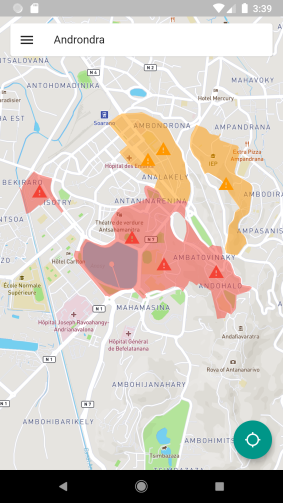

# Markovid

> Application permettant de voir les zones risquées dans le cadre du COVID-19

## Technologies 

1. NodeJS + Express
2. Typeorm
3. Socket.io
4. Postgresql + Postgis
5. Tauprolog

## Mobile

Voir [ici](https://github.com/rajaomariajaona/markovid-mobile)

## Deploiement (Heroku)

Voir [ici]()

## Screenshot

